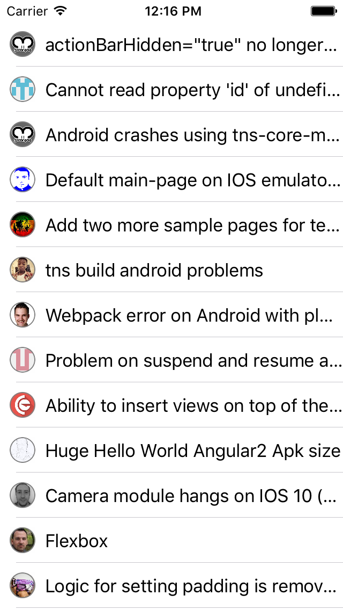

Use async/await with TypeScript in {N} today
============================================

(Sept 2016)

Its all about this:
``` TypeScript
export async function navigatingTo(args) {
  let page = args.object.page;
  let issues = await http.getJSON(nIssuesUrl);
  page.bindingContext = issues;
}
```
Populating up our list:


Async/await down compiling to ES5 was recently merged in the TypeScript master,
and is now available within the TypeScript @next version.

It comes with some nifty polyfils, but other than that it is pretty straight forward.

### Make an app
To use in {N} app, just make your new TypeScript enabled app:
```
tns create IssuesList --template typescript
cd IssuesList
npm install typescript@next --save-dev
code .
```

If VSCode asks you to use the TypeScript installed in the workspace - go yes,
currently if you don't, it will use an official TS version,
and may complain about `async` being supported when targeting ES6.

### Show me the helpers
{N} ships *commonjs* modules and emitting helpers in every module is undesirable.
{N} also provides __extend already, that helps extending native Objective-C and Java classes.

We will generate a single file with the required helpers for async/await.
Create an `app/helpers.ts` file with the following typescript:
```
export async function test() {}
```
Then run the @next tsc:
```
./node_modules/typescript/bin/tsc app/helpers.ts --target es5
```
Once the `app/helpers.js` is ready, **delete the `app/helpers.ts`**.
Also open the `.js` file and edit:
```
var __awaiter = ...
var __generator = ...
```
to
```
global.__awaiter = ...
global.__generator = ...
```
You may as well delete the `test()` function.

The {N} entry point is the `app/app.js` and we will make sure to import the helpers there:
```
require("./helpers");
import * as app from 'application';
app.start({ moduleName: 'main-page' });
```

### Ab/use
Now we can make a good use of the async/await in our app at `app/main-page.ts`:
``` TypeScript
import * as http from "http";

const nIssuesUrl = "https://api.github.com/repos/NativeScript/NativeScript/issues";

export async function navigatingTo(args) {
  let page = args.object.page;
  let issues = await http.getJSON(nIssuesUrl);
  console.log("issues: " + issues);
  page.bindingContext = issues;
}
```

All we have to do now is template these github issues in `app/main-page.xml`:
``` XML
<Page xmlns="http://schemas.nativescript.org/tns.xsd" navigatingTo="navigatingTo">
  <ListView items="{{ $value }}">
    <ListView.itemTemplate>
      <GridLayout columns="42, *" height="42">
        <Image src="{{ user.avatar_url }}"
            width="24" height="24"
            horizontalAlignmnet="center" verticalAlignment="center"
            borderColor="gray" borderWidth="1" borderRadius="12" />
        <Label col="1" text="{{ title }}" verticalAlignment="center" textAlignment="left" />
      </GridLayout>
    </ListView.itemTemplate>
  </ListView>
</Page>
```

### Run
We can finally run the app:
```
tns run ios
```
The NativeScript TypeScript plugin uses TypeScript compiler installed as dependency
(similar to the way VSCode got it working) so it will automatically pick the latest version.

Cheers,
